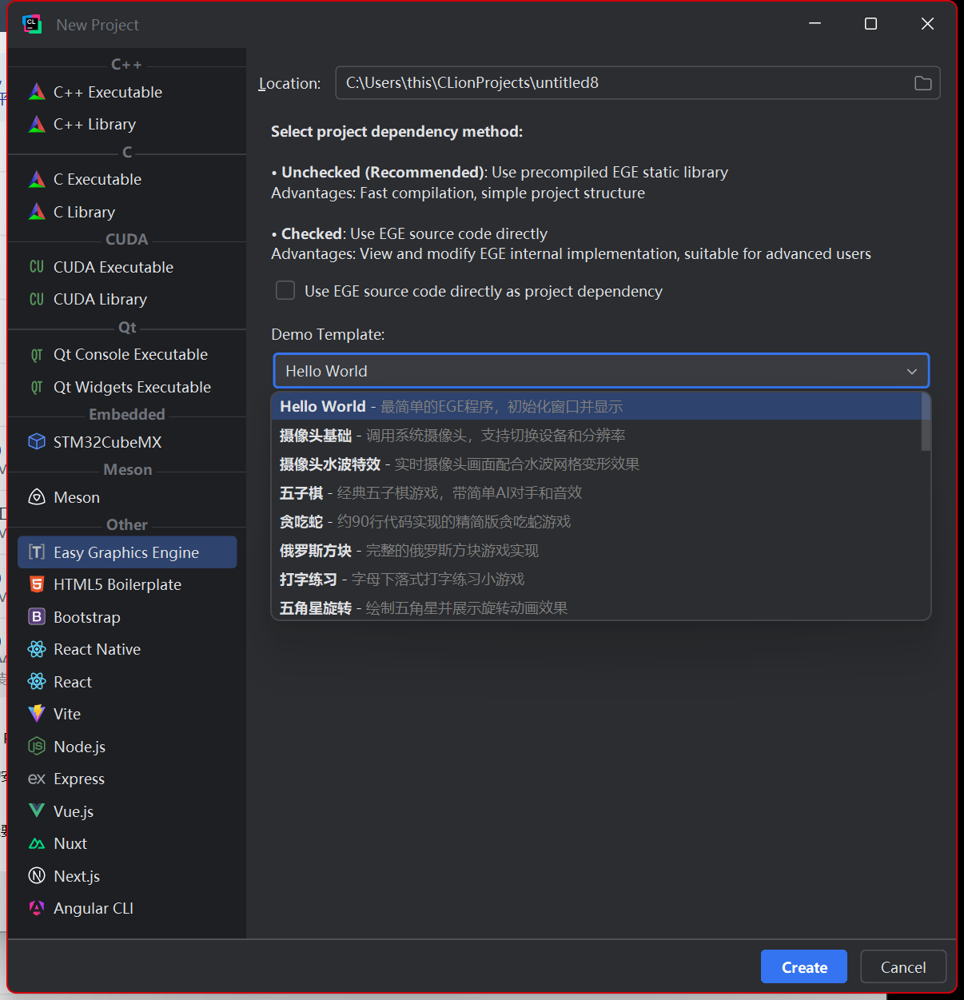
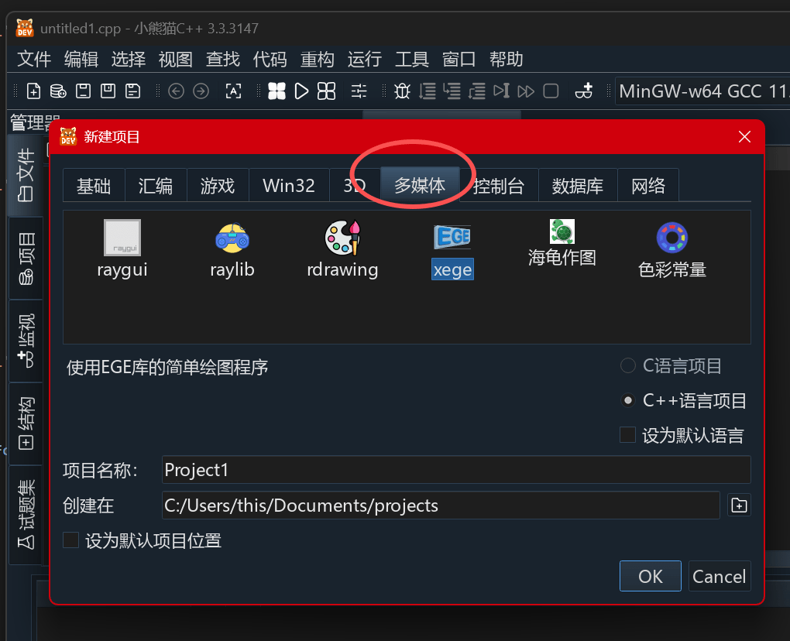
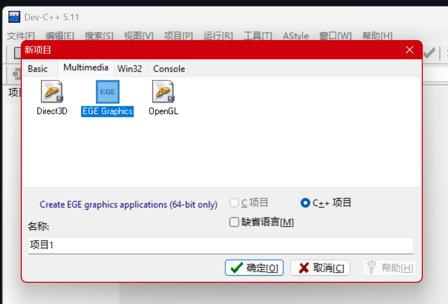
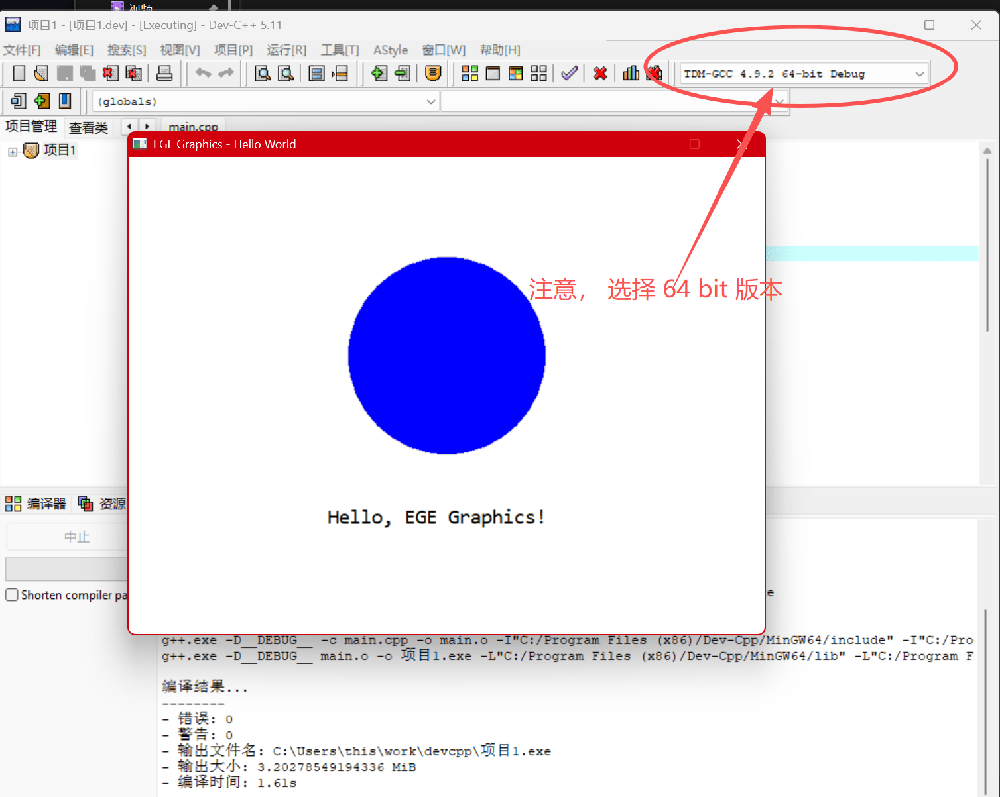

# EGE 安装使用教程

使用 **EGE Installer** 自动化安装器，可一键完成 EGE 在各种 IDE 中的配置，无需手动复制文件或配置链接器参数。

## 📖 目录

- [系统要求](#系统要求)
- [安装步骤](#安装步骤)
- [各 IDE 使用指南](#各-ide-使用指南)
  - [Visual Studio](#visual-studio)
  - [CLion](#clion)
  - [Red Panda C++](#red-panda-c)
  - [Code::Blocks](#codeblocks)
  - [Dev-C++](#dev-c)
  - [MinGW-w64 / MSYS2](#mingw-w64--msys2)
- [快速入门示例](#快速入门示例)
- [常见问题](#常见问题)
- [卸载说明](#卸载说明)

---

## 安装器特点

- 🔍 **智能检测** - 自动检测系统中已安装的 IDE 和编译器
- 📦 **项目模板** - 为 Code::Blocks、Dev-C++ 提供预配置项目模板
- 🔄 **完整卸载** - 一键清理所有安装的文件和模板
- 🎯 **手动扫描** - 深度搜索未检测到的 MinGW 安装

---

## 系统要求

- **操作系统**：Windows 10/11
- **权限**：管理员权限（用于复制文件到系统目录）
- **支持的 IDE**：
  - Visual Studio 2017-2026
  - MinGW-w64 / MSYS2
  - Red Panda C++、CLion
  - Dev-C++ 5.11+、Code::Blocks 20.03+

---

## 安装步骤

### 1. 下载安装器

访问 [GitHub Releases](https://github.com/x-ege/ege-installer/releases) 下载最新版本的 `ege-installer-x.x.x.exe`

### 2. 运行安装器

双击运行 `ege-installer-x.x.x.exe`，安装器会自动申请管理员权限。

> ⚠️ **为什么需要管理员权限？**  
> 安装器需要复制头文件和库文件到 IDE 的系统目录（如 Visual Studio 安装目录），这些目录受 Windows 保护，需要管理员权限才能写入。

当出现 Windows 用户账户控制 (UAC) 提示时，请点击 **"是"** 允许运行。

> 💡 **关于安全性**  
> 本安装器使用 HTA (HTML Application) 技术编写，所有代码均为明文可查看（JavaScript），完全开源透明。如果杀毒软件误报，请选择信任。您可以在 [GitHub 仓库](https://github.com/x-ege/ege-installer) 查看完整源代码。

### 3. 安装到 IDE

安装器启动后的界面如下：


安装步骤：

- 安装器会自动检测系统中已安装的 IDE
- 勾选您要安装 EGE 的 IDE，点击 **"安装"** 按钮
- 如果 MinGW 未被检测到，可使用 **"扫描 MinGW"** 功能手动搜索
- 安装完成后会显示 **"已安装"** 状态，并可查看使用说明

---

## 【安装完成后】各 IDE 使用指南

### Visual Studio

#### 📌 支持版本

- ✅ Visual Studio 2017, 2019, 2022, 2026
- ✅ 支持 Community、Professional、Enterprise 版本
- ✅ 支持 x86 和 x64 平台
- ❌ 不支持 VS 2015 及更早版本

#### 🚀 创建 EGE 项目

1. 打开 Visual Studio
2. **文件 → 新建 → 项目...**
3. 搜索并选择 **"空项目"** 或 **"控制台应用"**
4. 输入项目名称，点击 **"创建"**
5. 在 **解决方案资源管理器** 中，右键 **源文件** → **添加 → 新建项...**
6. 选择 **C++ 文件(.cpp)**，输入 `main.cpp`，点击 **"添加"**

> 💡 **提示**：VS 2017 的项目创建界面略有不同（旧版树形结构），但也可以通过类似方式找到"空项目"或"控制台应用"模板

#### 📝 编写代码

在 `main.cpp` 中输入以下代码：

```cpp
#include <graphics.h>

int main()
{
    // 初始化 640x480 的图形窗口
    initgraph(640, 480);
    
    // 设置背景色为深蓝色
    setbkcolor(BLUE);
    cleardevice();
    
    // 绘制白色文字
    setcolor(WHITE);
    setfont(36, 0, "微软雅黑");
    outtextxy(200, 200, "Hello, EGE!");
    
    // 等待按键
    getch();
    
    // 关闭图形窗口
    closegraph();
    return 0;
}
```

#### ▶️ 运行程序

- 按 **F5**（调试运行）或 **Ctrl+F5**（不调试运行）
- 推荐使用 **Ctrl+F5**，避免调试器干扰

#### ⚙️ 配置说明

✨ **好消息**：Visual Studio 使用 EGE 时**无需手动配置任何链接器选项**！

EGE 库使用了 `#pragma comment(lib, ...)` 自动链接特性，编译时会自动链接所需库文件。

#### ❓ 常见问题

**Q: 编译时提示找不到 `graphics.h`？**

- A: 重新运行安装器，确保选择了正确的 Visual Studio 版本并安装

**Q: 链接时出现 LNK2019 错误？**

- A: 检查项目平台架构（x86/x64）是否与库文件匹配，尝试清理并重新生成

**Q: 中文显示乱码？**

- A: 确保源文件使用 UTF-8 with BOM 编码保存，或在代码开头添加：

  ```cpp
  #pragma execution_character_set("utf-8")
  ```

---

### CLion

#### 📌 关于 CLion

CLion 是 JetBrains 出品的跨平台 C/C++ IDE，支持 CMake 构建系统。

#### 💡 推荐使用 CLion 插件

**EGE 已提供 JetBrains 官方插件**，可直接在 CLion 中搜索安装，无需手动配置库文件路径。插件提供一键新建 EGE 项目、自动配置 CMake 等功能，体验更佳且便于更新。

#### 🚀 创建 EGE 项目（推荐方式）

**步骤一：安装 EGE 插件**

1. 打开 CLion
2. **File → Settings → Plugins → Marketplace**
3. 搜索 **"EGE"** 或 **"xege Creator"**
4. 点击 **Install** 安装插件


**步骤二：新建 EGE 项目**

1. **File → New Project**
2. 在左侧项目类型中选择 **EGE**
3. 输入项目名称和保存路径
4. 点击 **Create**



> 💡 **提示**：插件会自动配置 CMakeLists.txt 和所有依赖项，无需手动编辑

**步骤三：编写代码**

插件会自动生成示例代码，直接运行即可看到效果。

#### ▶️ 运行程序

- 点击右上角的 **运行** 按钮（绿色三角）
- 或按 **Shift+F10**

#### 🛠️ 手动配置方式（备选）

如果您不使用插件，也可以手动安装 EGE 库文件到 MinGW：

1. **安装 MinGW 编译器** - 可使用 Red Panda C++ 内置的 MinGW 或单独安装 MinGW-w64 / MSYS2
2. **配置 CLion 工具链** - File → Settings → Build, Execution, Deployment → Toolchains，添加 MinGW 工具链
3. **使用安装器** - 运行 EGE 安装器，将 EGE 安装到对应的 MinGW 目录
4. **手动配置 CMakeLists.txt** - 添加 `target_link_libraries` 和 Windows 库依赖

但**强烈推荐使用插件方式**，配置更简单且不易出错。

#### ❓ 常见问题

**Q: 在哪里下载 CLion 插件？**

- A: 直接在 CLion 的 Marketplace 搜索 "EGE" 即可，或访问 [JetBrains 插件页面](https://plugins.jetbrains.com/plugin/28785-xege-creator/)

**Q: 插件和手动安装可以共存吗？**

- A: 可以。插件方式更方便，推荐优先使用插件

**Q: 手动配置时找不到 `graphics.h`？**

- A: 确保通过安装器将 EGE 安装到了 CLion 配置的 MinGW 工具链目录

---

### Red Panda C++

#### 📌 关于 Red Panda C++

Red Panda C++ 是一款现代化的 C/C++ IDE，内置 MinGW-w64 编译器，界面友好，非常适合初学者。

- 官网：[https://royqh.net/redpandacpp/](https://royqh.net/redpandacpp/)
- 开源：[https://github.com/royqh1979/RedPanda-CPP](https://github.com/royqh1979/RedPanda-CPP)

#### ✨ Red Panda 已内置 EGE

Red Panda C++ 已经内置了 EGE 图形库，开箱即用。本安装器将 EGE 更新到最新版本，自动添加到编译器的标准搜索路径，优先于内置版本。

#### 🚀 创建 EGE 项目

**使用项目模板（推荐）**

1. 打开 Red Panda C++
2. 点击 **文件 → 新建 → 项目...**
3. 选择 **Multimedia** 标签页
4. 点击 **EGE** 模板
5. 输入项目名称和保存路径，点击 **确定**



> 💡 **提示**：模板已配置所有选项，**无需手动设置**链接器参数

#### 📝 编写代码

在 `main.cpp` 中输入代码（参见下方 [快速入门示例](#快速入门示例)）

#### ▶️ 运行程序

- 按 **F11**（编译并运行）
- 或点击工具栏的 **运行** 按钮

#### ❓ 常见问题

**Q: 找不到 EGE 模板？**

- A: 完全关闭 Red Panda C++ 后重新打开，模板会自动加载

**Q: 想使用手动配置而非模板？**

- A: 创建控制台项目后，在项目属性的链接器参数中添加：`-lgraphics -lgdiplus -lgdi32 -limm32 -lmsimg32 -lole32 -loleaut32 -lwinmm -luuid -mwindows -static`

---

### Code::Blocks

#### 📌 支持版本

- ✅ Code::Blocks 20.03 及以上
- ✅ 推荐使用带 MinGW 的版本

#### 🚀 创建 EGE 项目

**方法一：项目向导（Code::Blocks 25.03+）**

1. 打开 Code::Blocks
2. **文件 → 新建 → 项目...**
3. 在左侧选择 **2D/3D Graphics** 分类
4. 选择 **EGE project**，点击 **Go**
5. 按提示输入项目名称和路径
6. 选择编译器（**GNU GCC Compiler**）
7. 完成创建


**方法二：用户模板**

1. **文件 → 从用户模板新建...**
2. 在 **EGE** 分类中选择 **EGE_Project**
3. 输入项目名称和路径


> ⚠️ 如果看不到模板，请关闭并重新打开 Code::Blocks

**方法三：手动配置**

如果模板不可用：

1. **文件 → 新建 → 项目...**
2. 选择 **Console Application**
3. 右键项目名称 → **Build options...**
4. 在 **Linker settings** 标签页的 **Link libraries** 添加：

   ```text
   graphics
   gdiplus
   gdi32
   imm32
   msimg32
   ole32
   oleaut32
   winmm
   uuid
   ```

5. 在 **Other linker options** 添加：

   ```text
   -mwindows
   -static
   ```

#### ▶️ 运行程序

- 按 **F9**（编译并运行）


#### 🔧 配置编译器

如果遇到编译器错误：

1. **Settings → Compiler...**
2. 选择 **GNU GCC Compiler**
3. 点击 **Toolchain executables** 标签页
4. 设置 **Compiler's installation directory** 指向 MinGW 目录
   - Code::Blocks 自带：`C:\Program Files\CodeBlocks\MinGW`
   - 或其他 MinGW 安装路径
5. 点击 **Auto-detect** 自动检测
6. 点击 **OK** 保存

#### ❓ 常见问题

**Q: 出现 "Can't find compiler executable" 错误？**

- A: 需要配置编译器路径，参见上方 [🔧 配置编译器](#🔧-配置编译器)

**Q: 在 2D/3D Graphics 中找不到 EGE project？**

- A: 使用方法二（用户模板）或方法三（手动配置）

---

### Dev-C++

#### 📌 支持版本

- ✅ Dev-C++ 5.11 及以上
- ✅ Embarcadero Dev-C++
- ⚠️ **仅支持 64 位编译**（x86_64 架构）- 不支持 32 位 (i686)

#### 🚀 创建 EGE 项目

**方法一：使用项目模板（推荐）**

1. 打开 Dev-C++
2. **文件 → 新建 → 项目...**
3. 选择 **Multimedia** 标签页
4. 点击 **EGE Graphics** 模板
5. 输入项目名称，点击 **确定**



> ⚠️ 如果没有看到 EGE Graphics 模板，请完全关闭 Dev-C++ 后重新打开

**方法二：手动配置**

如果模板不可用，可以创建空项目并手动配置：

1. **文件 → 新建 → 项目...**
2. 选择 **Console Application**
3. 输入项目名称

4. **配置链接器**
   - **工具 → 编译选项**
   - 在 **链接器** 输入框添加：

     ```text
     -lgraphics -lgdiplus -lgdi32 -limm32 -lmsimg32 -lole32 -loleaut32 -lwinmm -luuid -mwindows -static
     ```

#### ⚙️ 编译器架构设置

**重要**：Dev-C++ 安装器仅提供 64 位库文件，确保编译器架构设置正确：

1. **工具 → 编译选项**
2. **设置 → 代码生成 → 架构 = x86_64**
3. **不要**选择 i686（32 位不支持）



> 📝 **说明**：由于 32 位编译器使用较少且维护成本高，安装器仅包含 64 位库文件。如需 32 位支持，请参考官方文档手动配置。

#### ▶️ 运行程序

- 按 **F11**（编译并运行）

#### ❓ 常见问题

**Q: 编译时架构相关错误？**

- A: 检查编译器架构设置，必须选择 x86_64

**Q: Multimedia 标签页看不到 EGE Graphics？**

- A: 完全关闭 Dev-C++（检查任务管理器），重新启动后再试

---

### MinGW-w64 / MSYS2

#### 📌 支持版本

- ✅ MinGW-w64 所有版本（32/64 位）
- ✅ MSYS2 中的 MinGW
- ✅ 独立 MinGW 安装

#### 🚀 创建 EGE 项目

1. **创建项目目录**

   ```bash
   mkdir my_ege_project
   cd my_ege_project
   ```

2. **编写代码**
   创建 `main.cpp`，内容参见上方 [Visual Studio 示例](#编写代码)

3. **编译程序**

   **手动编译（推荐用于学习）：**

   ```bash
   g++ main.cpp -o main.exe -lgraphics -lgdiplus -lgdi32 -limm32 -lmsimg32 -lole32 -loleaut32 -lwinmm -luuid -mwindows -static
   ```

   **使用 Makefile（推荐用于项目）：**

   创建 `Makefile`：

   ```makefile
   CXX = g++
   CXXFLAGS = -std=c++11
   LDFLAGS = -lgraphics -lgdiplus -lgdi32 -limm32 -lmsimg32 -lole32 -loleaut32 -lwinmm -luuid -mwindows -static
   TARGET = main.exe
   SRCS = main.cpp
   
   all: $(TARGET)
   
   $(TARGET): $(SRCS)
    $(CXX) $(CXXFLAGS) $^ -o $@ $(LDFLAGS)
   
   clean:
    del $(TARGET)
   
   run: $(TARGET)
    $(TARGET)
   ```

   然后运行：

   ```bash
   make        # 编译
   make run    # 运行
   ```

4. **运行程序**

   ```bash
   ./main.exe
   ```

#### 📝 链接器参数说明

| 参数 | 说明 |
|------|------|
| `-lgraphics` | EGE 核心库 |
| `-lgdiplus` | Windows GDI+ 库（图形绘制） |
| `-lgdi32` | Windows GDI 库 |
| `-limm32` | 输入法管理器（中文输入） |
| `-lmsimg32` | 图像混合 |
| `-lole32` `-loleaut32` | OLE 自动化 |
| `-lwinmm` | Windows 多媒体 |
| `-luuid` | UUID 支持 |
| `-mwindows` | 创建 Windows 子系统程序（无控制台） |
| `-static` | 静态链接，生成独立可执行文件 |

#### ❓ 常见问题

**Q: 编译时提示找不到 `-lgraphics`？**

- A: 确保已通过安装器安装到 MinGW，检查 `<MinGW>/lib/` 目录下是否有 `libgraphics.a`

**Q: 程序运行时提示缺少 DLL？**

- A: 确保使用了 `-static` 参数进行静态链接

---

## 快速入门示例

安装完成后，编写一个简单的 Hello World 程序测试安装是否成功：

```cpp
#include <graphics.h>

int main()
{
    initgraph(640, 480);
    
    setbkcolor(WHITE);
    cleardevice();
    
    setcolor(BLACK);
    setfont(24, 0, "Arial");
    outtextxy(250, 220, "Hello, EGE!");
    
    getch();
    closegraph();
    return 0;
}
```

**编译运行**：按照对应 IDE 的说明编译并运行程序。如果看到白色窗口中显示 "Hello, EGE!"，说明安装成功！

### 更多示例

想要学习更多 EGE 功能？访问以下资源：

- **官方教程**：[https://xege.org/man/tutorial/](https://xege.org/man/tutorial/) - 系统的新手入门教程
- **API 文档**：[https://xege.org/man/api/](https://xege.org/man/api/) - 完整的函数参考手册
- **示例程序**：[https://xege.org/category/demo/](https://xege.org/category/demo/) - 丰富的代码示例和效果展示

---

## 常见问题

### 安装相关

**Q: 安装时提示需要管理员权限？**

- A: 右键安装器，选择"以管理员身份运行"

**Q: 安装器检测不到我的 IDE？**

- A:
  1. 确保 IDE 已正确安装
  2. 对于 MinGW，使用"扫描 MinGW"功能手动搜索
  3. 检查安装路径是否符合常见模式

**Q: 能否同时安装到多个 IDE？**

- A: 可以！勾选所有想要安装的 IDE，分别点击"安装"按钮即可

### 编译相关

**Q: 编译时提示找不到 `graphics.h`？**

- A:
  1. 确保已通过安装器安装到对应 IDE
  2. 重启 IDE 后再试
  3. 检查 IDE 的 include 路径设置

**Q: 链接时出现 `undefined reference` 错误？**

- A:
  1. 检查是否添加了所需的链接器参数（见各 IDE 的配置说明）
  2. 确认链接库的顺序（`-lgraphics` 应该在最前面）
  3. 对于 Dev-C++，确认使用了 64 位编译器

**Q: 编译后程序无法运行，提示缺少 DLL？**

- A: 添加 `-static` 链接参数，进行静态链接

### 运行相关

**Q: 程序运行后立即闪退？**

- A:
  1. 确保在 `closegraph()` 前调用了 `getch()` 等待用户输入
  2. 使用 Ctrl+F5（VS）或不调试运行

**Q: 中文显示乱码？**

- A:
  1. 源文件使用 UTF-8 with BOM 编码保存
  2. 在代码开头添加 `#pragma execution_character_set("utf-8")`
  3. 使用宽字符版本的函数

**Q: 图形窗口无法响应（假死）？**

- A: 在图形循环中使用 `delay_ms()` 或 `delay_fps()` 让出 CPU 时间

### 其他问题

**Q: 如何更新 EGE 到新版本？**

- A: 下载新版安装器，先卸载旧版本，再重新安装

**Q: 可以在 Visual Studio Code 中使用 EGE 吗？**

- A: 可以！VS Code 需要配置 C++ 编译环境（MinGW 或 MSVC），配置方法与对应编译器相同

**Q: EGE 支持跨平台吗？**

- A: 目前仅支持 Windows。Linux/macOS 用户可以考虑使用 SDL2 或 raylib 等跨平台图形库

---

## 卸载说明

### 使用安装器卸载

1. 再次运行 `ege-installer-x.x.x.exe`（以管理员身份）
2. 找到要卸载的 IDE
3. 点击 **"卸载"** 按钮
4. 等待卸载完成

安装器会自动删除：

- 头文件（`graphics.h`, `ege.h` 等）
- 库文件（`libgraphics.a` 等）
- 项目模板（Code::Blocks、Dev-C++）
- 所有相关文件

### 手动卸载

如果安装器不可用，可以手动删除以下文件：

**Visual Studio:**

- `C:\Program Files (x86)\Microsoft Visual Studio\<版本>\<版本类型>\VC\Tools\MSVC\<工具集版本>\include\graphics.h`
- `C:\Program Files (x86)\Microsoft Visual Studio\<版本>\<版本类型>\VC\Tools\MSVC\<工具集版本>\include\ege.h`
- `C:\Program Files (x86)\Microsoft Visual Studio\<版本>\<版本类型>\VC\Tools\MSVC\<工具集版本>\include\ege\*`
- `C:\Program Files (x86)\Microsoft Visual Studio\<版本>\<版本类型>\VC\Tools\MSVC\<工具集版本>\lib\<平台>\*graphics*.lib`

**MinGW:**

- `<MinGW>\include\graphics.h`
- `<MinGW>\include\ege.h`
- `<MinGW>\include\ege\*`
- `<MinGW>\lib\libgraphics.a`

**Code::Blocks:**

- `<CodeBlocks>\share\CodeBlocks\templates\EGE_Project.cbp`
- `<CodeBlocks>\share\CodeBlocks\templates\EGE_Project.template`
- `<CodeBlocks>\share\CodeBlocks\templates\wizard\ege\*`

**Dev-C++:**

- `<DevCpp>\Templates\EGE_Graphics.template`
- `<DevCpp>\Templates\EGE_main_cpp.txt`
- `<DevCpp>\Icons\ege-template.ico`

---

## 更多信息

### 相关链接

- **API 文档**：[https://xege.org/man/api/](https://xege.org/man/api/)
- **教程专区**：[https://xege.org/man/tutorial/](https://xege.org/man/tutorial/)
- **GitHub 仓库**：[https://github.com/x-ege/xege](https://github.com/x-ege/xege)
- **安装器源码**：[https://github.com/x-ege/ege-installer](https://github.com/x-ege/ege-installer)
- **问题反馈**：[GitHub Issues](https://github.com/x-ege/ege-installer/issues)

### 开源协议

EGE 图形库及安装器采用 MIT License 开源。

---

*最后更新：2026-02-08*
