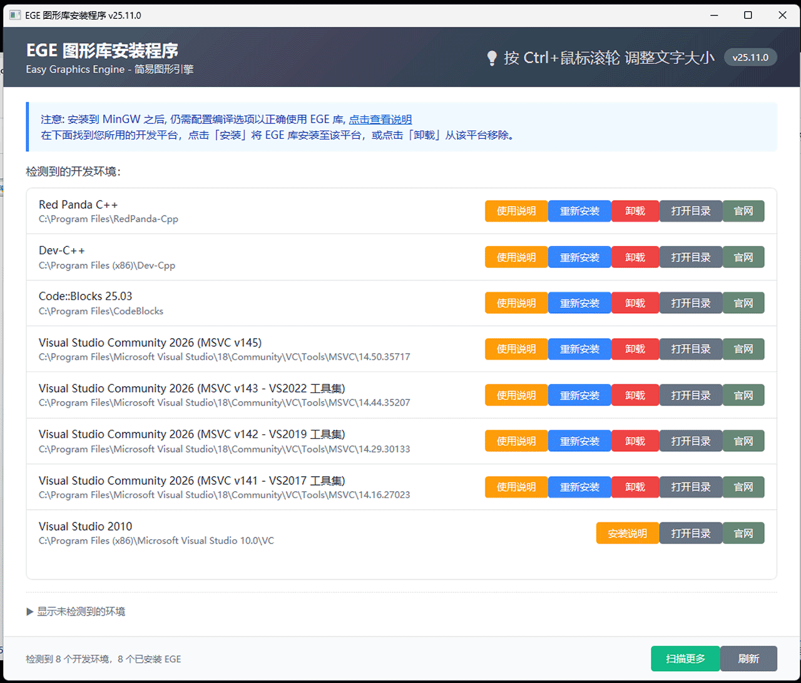

# EGE Installer

[](https://github.com/x-ege/xege)
[](LICENSE)

Modern installer for [EGE (Easy Graphics Engine)](https://github.com/x-ege/xege) - automatically detects and configures EGE library for various IDEs and compilers.



## ✨ Features

- 🔍 **Smart Detection** - Automatically detects installed IDEs using registry, vswhere, and filesystem scanning
- 🎯 **Wide Compatibility** - Supports Visual Studio, MinGW, Red Panda, Dev-C++, Code::Blocks, CLion
- 🔄 **Install & Uninstall** - One-click installation and removal with complete cleanup support
- 📦 **Project Templates** - Pre-configured CodeBlocks project templates with automatic linker setup
- 📚 **Usage Guide** - Interactive usage instructions displayed after installation
- 🔎 **Manual Scan** - Recursively scan directories to find MinGW installations (depth: 7 layers)
- 📊 **Detailed Progress** - Real-time installation logs and progress tracking
- 🖥️ **DPI Aware** - Adaptive UI scaling for high-DPI displays
- ⚡ **Lightweight** - ~20MB package with silent extraction and fast deployment
- 🎨 **Modern UI** - Clean single-page interface based on EasyX design

## 🎯 Supported IDEs

| IDE | Detection Methods | Library Support | Notes |
| ----- | ------------------ | ----------------- | ------- |
| **Visual Studio** | vswhere + Registry | VS 2017-2026 | x86/x64 auto-detection, VS2017+ use unified msvc library |
| **MinGW-w64** | Filesystem Scan | MSYS2, Standalone | Support for 32/64-bit variants |
| **Red Panda C++** | Predefined Paths | Dedicated Library | Independent IDE with built-in MinGW |
| **CLion** | Toolbox + Direct Install | Shared with Red Panda | Toolbox/Direct installation |
| **Dev-C++** | Predefined Paths | Embarcadero, Legacy | 64-bit only, standard variants |
| **[Code::Blocks](https://www.codeblocks.org/downloads/binaries/)** | Predefined Paths | Latest | MinGW bundled version |

## 📦 Tech Stack

- **UI Framework**: HTA (HTML Application) with JScript
- **Packaging**: NSIS 3.11 with DPI manifest
- **Build Tool**: PowerShell automation script
- **Detection**: COM objects (WScript.Shell, Scripting.FileSystemObject)

## 🚀 Quick Start

### For Users

**📖 [Installation Guide](INSTALLATION.md)** - Complete tutorial for installing and using EGE with various IDEs (Chinese)

**Quick steps:**

1. Download `ege-setup-x.x.x.exe` from [Releases](https://github.com/x-ege/ege-installer/releases)
2. Run installer with administrator privileges
3. Select IDEs to install EGE library
4. Click "Install" button for each IDE

For detailed instructions, IDE-specific guides, and troubleshooting, see the [Installation Guide](INSTALLATION.md).

### For Developers

#### Prerequisites

- Windows 10/11
- PowerShell 5.1+
- Git (for cloning dependencies)
- NSIS 3.11+ (build only, [Download](https://nsis.sourceforge.io/Download))

#### Quick Setup

Run the setup script to prepare the development environment:

```powershell
# Interactive mode - prompts for confirmation
.\scripts\setup.ps1

# Auto mode - no prompts, ideal for CI
.\scripts\setup.ps1 -Auto
```

The script will:

- Check if `../xege_libs/` exists
- Offer to clone [xege-sdk](https://github.com/x-ege/xege-sdk) if missing
- Verify NSIS installation (optional)

#### Development Mode

Run installer directly without building:

```powershell
# Method 1: Using mshta
mshta.exe .\src\setup.hta

# Method 2: Using VSCode task
# Ctrl+Shift+B → Run Installer
```

#### Build Package

```powershell
# Build with EGE library version (from xege_libs/version.txt)
.\scripts\build.ps1

# Build with custom version (override version.txt)
.\scripts\build.ps1 -Version "1.2.3"

# Build with custom library path (CI)
.\scripts\build.ps1 -XegeLibsPath "C:\path\to\xege_libs"
```

**Version Source Priority**:

1. `-Version` parameter (manual override)
2. `xege_libs/version.txt` (EGE library version)
3. Fallback to `1.0.0` if version.txt not found

**Output**: `dist/ege-setup-<version>.exe` (~20 MB)

#### Build Tasks (VSCode)

- **Run Installer** - `Ctrl+Shift+B` → Run Installer
- **Build Package** - `Ctrl+Shift+B` → Build Package (default)
- **Clean Build** - `Ctrl+Shift+B` → Clean Build

## 📁 Project Structure

```
ege-installer/
├── src/
│   ├── setup.hta           # Main UI with HTML/CSS structure
│   ├── ui.js               # UI interaction logic (extracted from HTA)
│   ├── detector.js         # IDE detection module
│   │   ├── msvcToolsetMapping         # MSVC version to toolset mapping
│   │   ├── getMsvcToolsetInfo()       # Parse MSVC version (14.xx.xxxxx)
│   │   ├── detectVSWithVswhere()      # VS 2017+ multi-toolset detection
│   │   ├── detectVSFromRegistry()     # VS 2010-2015 detection (not supported)
│   │   ├── detectMinGW()              # MinGW installations
│   │   ├── detectRedPanda()           # Red Panda C++ (independent)
│   │   ├── detectDevCpp()             # Other Dev-C++ variants
│   │   ├── detectCodeBlocks()         # Code::Blocks + template detection
│   │   └── detectCLion()              # CLion (3 modes)
│   └── installer.js        # Installation/uninstall logic
│       ├── installHeaders()           # Header files installation
│       ├── installLibs()              # Library files installation
│       ├── installCodeBlocksTemplate()     # Project template installation
│       ├── uninstallCodeBlocksTemplate()   # Template cleanup
│       ├── showCodeBlocksUsageGuide()      # Display usage instructions
│       └── libDirMapping              # IDE-to-library mapping
├── assets/
│   ├── templates/          # IDE project templates
│   │   └── codeblocks/     # CodeBlocks project template
│   │       ├── EGE_Project.cbp       # Pre-configured project file
│   │       ├── EGE_Project.template  # XML template descriptor
│   │       ├── main.cpp              # Unified template source (Hello World)
│   │       └── wizard/               # Project wizard for CB 25.03+
│   │           ├── wizard.script     # Squirrel wizard script
│   │           ├── logo.png          # 32x32 wizard icon
│   │           └── wizard.png        # 116x280 wizard sidebar
│   ├── docs/               # User documentation
│   │   └── codeblocks-usage.md   # CodeBlocks usage guide
│   └── ege-icon.ico        # Application icon
├── scripts/
│   ├── setup.ps1           # Development environment setup
│   ├── build.ps1           # Build script (NSIS)
│   └── installer.nsi       # NSIS packaging configuration
├── .github/
│   └── workflows/
│       └── build.yml       # GitHub Actions CI/CD
├── .vscode/
│   ├── tasks.json          # Build tasks configuration
│   └── launch.json         # Debug configuration
├── LICENSE                 # MIT License
├── dist/                   # Build output directory
└── logs/                   # Build logs
```

## 📁 EGE Library Structure

Expected library structure in `../xege_libs/`:

```
xege_libs/
├── include/
│   ├── ege.h
│   ├── graphics.h
│   └── ege/              # EGE internal headers
├── lib/
│   ├── msvc/             # Visual Studio 2017-2026 (unified)
│   │   ├── x64/
│   │   └── x86/
│   ├── mingw32/          # MinGW 32-bit
│   ├── mingw64/          # MinGW 64-bit
│   ├── redpanda/         # Red Panda & CLion
│   ├── devcpp/           # Dev-C++
│   └── codeblocks/       # Code::Blocks
```

## 🔍 Manual Scan Feature

If your MinGW installation is not automatically detected, use the "Scan MinGW" button to manually search directories (max depth: 7 layers).

## 🐛 Troubleshooting

### Build Issues

**Error**: "Can't open output file"

- **Cause**: NSIS cannot write to `dist/` directory
- **Solution**: Close any running installer processes, ensure `dist/` is writable

**Error**: "NSIS not found"

- **Solution**: Install NSIS 3.11+ and ensure it's in system PATH

### Detection Issues

**IDE not detected**

- Try "Scan MinGW" button to manually search directories
- Check IDE installation path matches expected patterns
- For CLion: Ensure MinGW is bundled at `bin\mingw\`

**DPI Scaling Issues**

- Installer automatically detects DPI via registry
- If UI appears too large/small, check Windows display scaling settings

## 📝 Changelog

### Latest Changes (2026-02-03)

- ✨ **MSVC Library Consolidation**: Adapted to xege-sdk's unified MSVC library structure
  - VS2017-VS2026 now use unified `msvc/` directory (60% size reduction)
  - VS2010-2015 are no longer supported by the installer
  - Improved installer logic to handle version-specific library mapping
- 📚 **Documentation Update**: Updated library structure documentation to reflect unified MSVC directory

### Changes (2026-02-01)

- **Project Templates**: Added CodeBlocks project template with pre-configured linker settings
- 📚 **Usage Guide**: Interactive usage instructions displayed after installation
- 🔧 **Uninstall Enhancement**: Complete cleanup including templates and all installed files
- 🔍 **Template Detection**: Improved CodeBlocks detection to check for installed templates
- 📁 **Project Restructure**: Moved templates to `assets/` directory for better organization
- 📝 **Documentation**: Added comprehensive CodeBlocks usage guide with examples
- ✨ **Multiple MSVC Toolset Support**: VS 2017+ installations now detect all installed MSVC toolsets (v141/v142/v143)
- 🔧 Automatically identifies and lists individual toolsets (e.g., VS2026 with VS2017/2019/2022 compilers)
- 🔧 **Version Management**: Installer now uses EGE library version from `xege_libs/version.txt`
- 🪟 **Window Behavior**: Support resizable window with minimum size constraint

### Changes (2026-02-01)

- ✨ Separated Red Panda as independent IDE
- ✨ Added CLion support with 3 detection modes
- 🔧 Enhanced MinGW scan (7 layers, expanded keywords)
- 🔧 Unified CLion display to "CLion (MinGW)"
- 🐛 Fixed CLion duplicate detection
- 🐛 Improved error handling and logging
- 📝 Updated UI text and warnings

## 🤝 Contributing

Contributions are welcome! Please feel free to submit pull requests or open issues.

## 📄 License

[MIT License](LICENSE) - Copyright (c) 2026 EGE Project

## 🔗 Links

- **EGE Library**: <https://github.com/x-ege/xege>
- **Documentation**: <https://xege.org/>
- **Issues**: <https://github.com/x-ege/ege-installer/issues>
