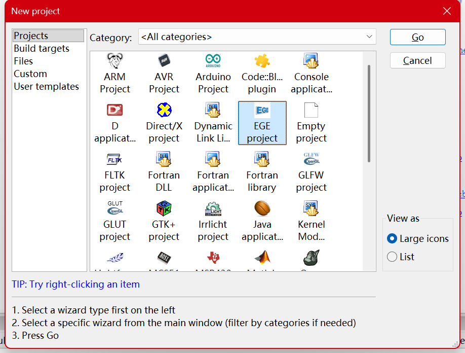
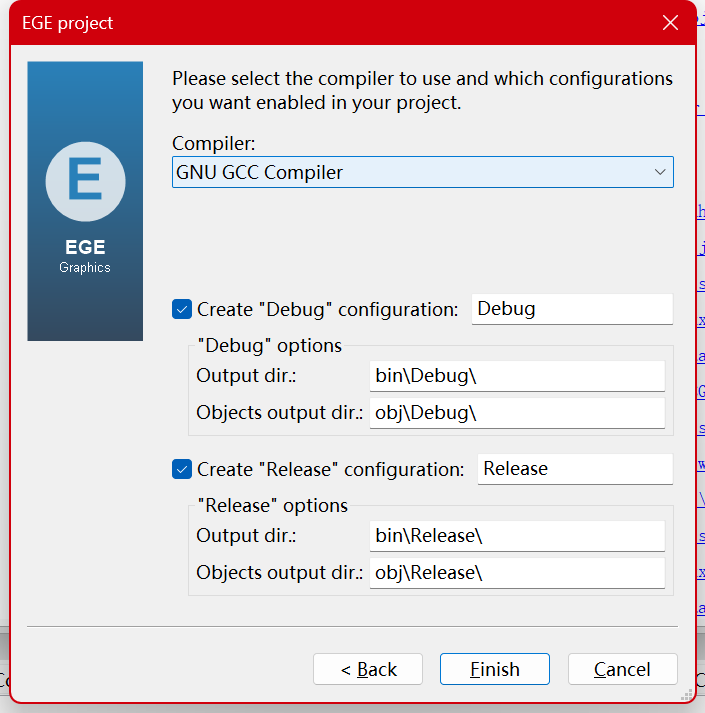
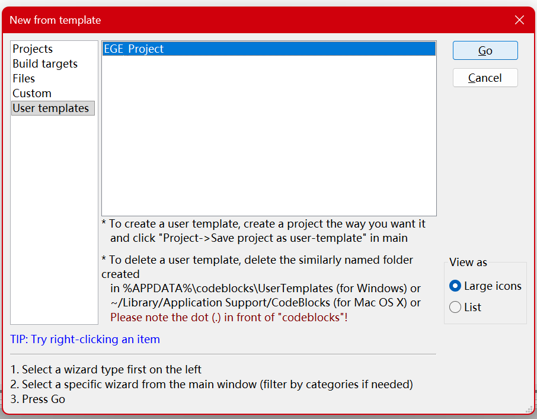
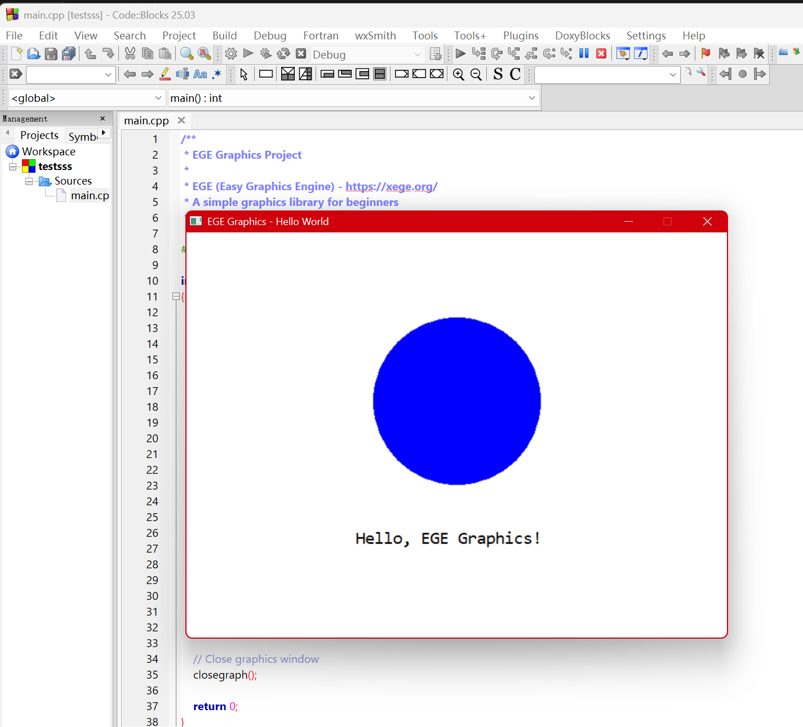

# Code::Blocks EGE 项目使用指南

## 🎉 安装成功

EGE 图形库已成功安装到您的 Code::Blocks！现在就可以开始创建图形项目了。

---

## 📝 创建新的 EGE 项目

### 方法一：从项目向导创建（推荐，Code::Blocks 25.03+）

1. 打开 Code::Blocks
2. 点击菜单：**文件 → 新建 → 项目...**
3. 在左侧选择 **Projects**，分类选择 **2D/3D Graphics**
4. 找到 **EGE project**，点击 **Go**
5. 按提示输入项目名称和保存路径
6. **选择编译器**：选择已正确配置的编译器（如 **GNU GCC Compiler**）
7. 完成创建




**项目向导已自动配置好所有编译和链接选项，无需手动设置。**

> ⚠ 如果在 2D/3D Graphics 中没有看到 EGE project，请关闭并重新打开 Code::Blocks 后再试。
> 如果您的 Code::Blocks 版本低于 25.03，请使用方法二。

---

### 方法二：从用户模板创建

1. 打开 Code::Blocks
2. 点击菜单：**文件 → 新建 → 从模板...**
3. 在分类中找到：**EGE**，选择：**EGE_Project**
4. 输入项目名称和保存位置
5. 点击确定，项目创建完成！

> ⚠ 如果模板列表里暂时看不到 **EGE_Project**，请关闭并重新打开 Code::Blocks 后再试（部分版本需要重启才能刷新模板缓存）。



> 如果您使用的 Code::Blocks 版本没有“从模板...”，也可以尝试：
> **文件 → 从用户模板新建...** → 选择 **EGE_Project**

**模板已自动配置好所有链接选项，无需手动设置。**

---

## 🚀 快速开始示例

创建 `main.cpp` 并输入以下代码：

```cpp
#include <graphics.h>

int main()
{
    // 初始化图形窗口 (640x480)
    initgraph(640, 480, 0);
    
    // 设置窗口标题
    setcaption("EGE Graphics - Hello World");
    
    // 设置背景色为白色
    setbkcolor(WHITE);
    cleardevice();
    
    // 绘制一个蓝色填充圆
    setfillcolor(BLUE);
    fillellipse(320, 200, 100, 100);
    
    // 设置文字颜色并输出
    setcolor(BLACK);
    setfont(24, 0, "微软雅黑");
    outtextxy(220, 350, "Hello, EGE Graphics!");
    
    // 等待用户按键
    getch();
    
    // 关闭图形窗口
    closegraph();
    
    return 0;
}
```

点击 **Build and run** (F9) 即可运行程序！



---

## 📚 更多资源

- **官方网站**: <https://xege.org/>
- **API 文档**: <https://xege.org/man/api/>
- **示例教程**: <https://xege.org/man/tutorial/>
- **GitHub**: <https://github.com/wysaid/xege>

---

## 🔧 故障排除

### 编译器配置问题

如果遇到编译器相关错误，请检查 Code::Blocks 的编译器配置：

#### 检查并配置编译器路径

1. 打开 Code::Blocks
2. 点击菜单：**Settings → Compiler...**
3. 在 **Selected compiler** 下拉列表中，选择你要使用的编译器（推荐 **GNU GCC Compiler**）
4. 点击 **Toolchain executables** 标签页
5. **Compiler's installation directory** 应该指向：
   - Code::Blocks 自带 MinGW：`C:\Program Files\CodeBlocks\MinGW`
   - 或其他 MinGW 安装路径（如 `C:\mingw64`、`C:\msys64\mingw64` 等）
6. 验证下方的程序文件名：
   - C compiler: `gcc.exe`
   - C++ compiler: `g++.exe`
   - Linker for dynamic libs: `g++.exe`
   - Linker for static libs: `ar.exe`
7. 点击 **Auto-detect** 按钮可以自动检测
8. 点击 **OK** 保存设置

#### 修复"Can't find compiler executable"错误

如果出现此错误，说明编译器路径未正确配置：

1. **Settings → Compiler → Toolchain executables**
2. 点击 **Auto-detect** 按钮
3. 如果自动检测失败，手动选择 Code::Blocks 自带的 MinGW：
   - 点击路径输入框旁的 **...** 按钮
   - 浏览到 `C:\Program Files\CodeBlocks\MinGW`
   - 点击确定
4. 验证编译器可执行文件（gcc.exe、g++.exe 等）
5. 点击 **OK** 保存

**提示**：如果有多个编译器，建议选择默认的 **GNU GCC Compiler** 并配置为 Code::Blocks 自带的 MinGW。

---

## ⚙️ 高级配置

### 手动配置现有项目

如果您需要在现有项目中使用 EGE，请按以下步骤配置：

#### 1. 打开项目设置

- 右键点击项目名称 → **Build options...**

#### 2. 配置链接器选项

在 **Linker settings** 标签页：

**Link libraries 区域添加：**

```text
graphics
gdiplus
gdi32
imm32
msimg32
ole32
oleaut32
winmm
uuid
```

**Other linker options 区域添加：**

```text
-mwindows
-static
```

#### 3. 保存设置

点击 **OK** 保存所有设置。

---

## ❓ 常见问题

### Q: 编译时提示找不到 graphics.h？

**A**: 确保已安装到正确的 Code::Blocks，重新运行安装程序。

### Q: 出现"Can't find compiler executable"错误？

**A**: 这是编译器配置问题。请参阅上方 [故障排除 - 编译器配置问题](#故障排除) 章节。

### Q: 链接时出现 undefined reference 错误？

**A**: 检查链接器设置中是否添加了所有必需的库。使用项目模板创建的项目已自动配置。如需手动配置，请参阅 [高级配置](#高级配置) 章节。

### Q: 程序运行时闪退？

**A**: 检查是否调用了 `getch()` 等待用户输入，避免窗口立即关闭。

### Q: 在 2D/3D Graphics 中找不到 EGE project？

**A**: 请关闭并重新打开 Code::Blocks，或者使用方法二（用户模板）创建项目。

### Q: 如何卸载 EGE？

**A**: 运行安装程序，点击"卸载"按钮即可删除已安装的文件。

---

## 💡 使用提示

- **推荐使用项目模板**：自动配置所有选项，开箱即用
- **按 F9 快速编译运行**：最快捷的测试方式
- **遇到问题先查看常见问题**：大部分问题都有标准解决方案
- **官方文档有更多示例**：<https://xege.org/man/tutorial/>

祝您使用愉快！🎨
